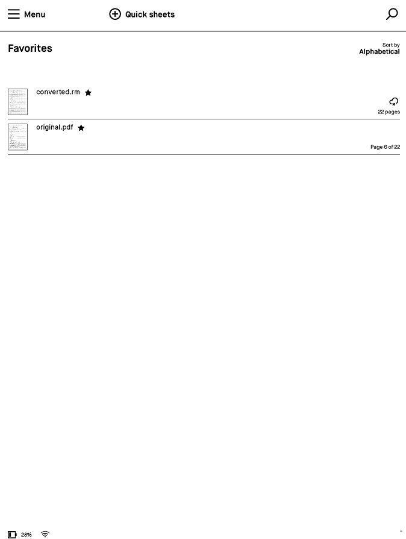

Note: I am no longer using this project and I have archived it. Feel free to fork.

# remarkable-layers

Python module for reading and writing Remarkable Lines files (*.rm).

Currently only supports version 5 of Remarkable Lines files.

This module and supporting routines are experimental.

## Installation

The module is still in development.

You can install it with the following pip command.

```bash
pip install git+https://github.com/bsdz/remarkable-layers.git#master
```

Alternatively, you can install it by cloning this repository and using the [poetry install](https://python-poetry.org/docs/cli/#install) command.


## Core Dependencies

The core module for reading & writing rm line files only uses core python standard library.

The SVG conversion module utilises numpy and lxml.

The example scripts introduce other dependencies.

## Usage

Read a RM Lines binary file.

```python
from pathlib import Path
from rmlines import RMLines

p = Path("./samples/03f23a6e-c14b-4dba-836d-828707979356.rm")
rm0 = RMLines.from_bytes(p.open("rb"))
```

Dump internal structure of RM Lines to logger.

```python
import logging
logging.basicConfig(level="DEBUG")
# To reduce logging for some binary types, eg:
# logging.getLogger('rmlines.rmobject.segment').setLevel(logging.INFO)

rm0.dump()
```

Convert to SVG (as strokes).

```python
from io import StringIO
from IPython.display import SVG

sbuffer = StringIO()
rm0.to_svg(sbuffer)
SVG(sbuffer.getvalue().encode())
```

Convert simple SVG file into RM Lines format. Can only contain paths with simple line segments. For conversion of PDF to simple SVG see pdf_converter.py below.

```python
p = Path("./my_simple.svg")
rm0 = RMLines.from_svg(f.open("rb")
```

## Example Scripts

### rmlines_pdf_converter

This script converts a pdf to several intermediate SVG files, one per page, then generates RM Lines notebook that is uploaded to Remarkable Cloud. The SVG output files are simplified SVG that the RM Lines module can process. That is all beziers have been linearized and raster images traced into paths. This can be time consuming.

Typical usage:

```bash
rmlines_pdf_converter my_file.pdf --first 10 --last 25
```

Use "--help" flag for more options.

#### Additional Dependencies

Applications: inkscape and pdfinfo. 
Python modules: potrace, svgpathtools, svgwrite, pillow and rmapy. Note that in pyproject.toml some dependencies reference git branches / revisions and/or forks.

### pen_gallery

This script uses hershey stroke fonts to place text in Remarkable lines files with different pen styles. More fonts are available at [SVG Fonts repo](ttps://gitlab.com/oskay/svg-fonts).

## Obtaining a cloud token for upload

Currently, one should initialize their connection to Remarkable Cloud using rmapy directly. You can obtain a one time token from [Remarkable's Mobile Connect](https://my.remarkable.com/connect/mobile) page.

Then follow example as [described here](https://rmapy.readthedocs.io/en/latest/quickstart.html#registering-the-api-client). Eg,

```python
from rmapy.api import Client
rmapy = Client()
rmapy.register_device("<YOUR ONE TIME TOKEN>")
```
You should only need to do this once.

## Known issues

Conversion from RM to SVG is very basic and doesn't support the Remarkable pen tips that are stored as PNG images.

Conversion from PDF to RM shows all text and objects as outlines. This is a bit annoying but a limitation of Remarkable's Lines format that doesn't support fills. I think the reason for Remarkable's decision to not support SVG directly is because they actually map PNG images over the stroke paths and this might be difficult/impossible to do with SVG.

The round trip mapping, eg read RM to binary and convert back to again, does not support all pen configurations.

This has only be tested on Linux and not Windows.

This is a very experimental package created so I can properly take notes and test mathematical texts. I'm still not sure if it will solve my use case.

## Demo




